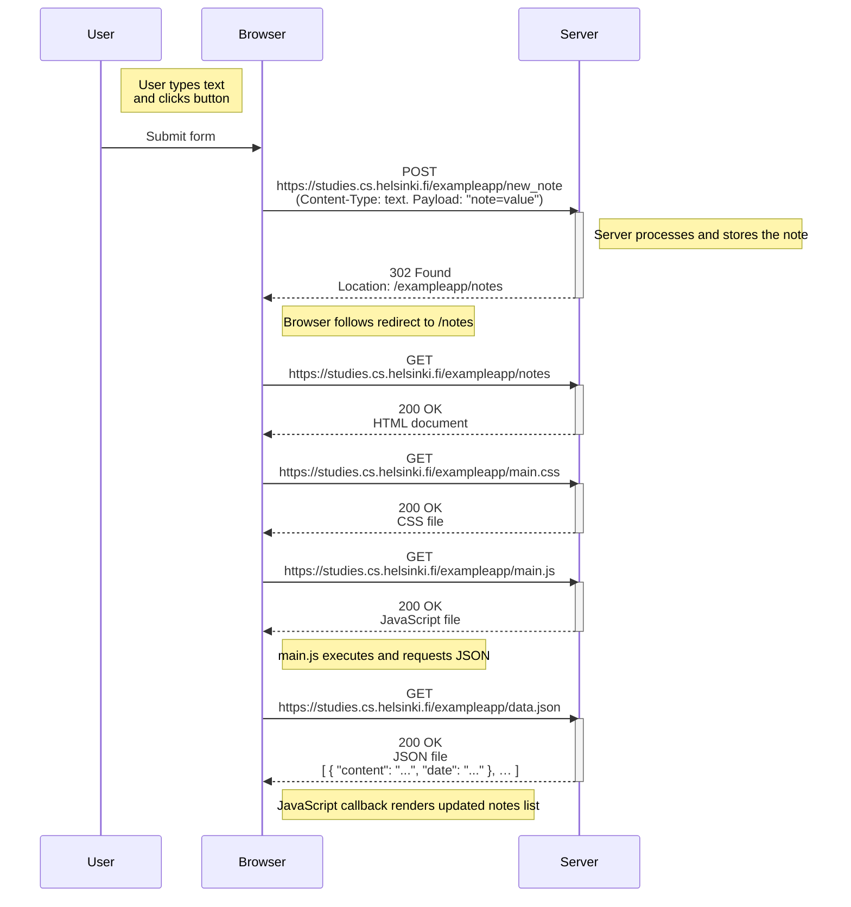

<!--
	Full stack open
	exercise 0.4: New note diagram
	Martin (maizena-y-javascript). 2025
-->

```mermaid

sequenceDiagram
	participant User
	participant Browser
	participant Server

	Note right of User: User types text<br>and clicks button
	User->>Browser: Submit form

	Browser->>Server: POST<br>https://studies.cs.helsinki.fi/exampleapp/new_note<br>(Content-Type: text. Payload: "note=value")
	
	activate Server
	Note right of Server: Server processes and stores the note
	Server-->>Browser: 302 Found<br>Location: /exampleapp/notes
	deactivate Server

	%% (cache version)
	%% Note right of Browser: Browser follows redirect to /notes
	%% Browser->>Browser: load /exampleapp/notes (index.html) from cache (304 Not Modified)
	%% Browser->>Browser: load /exampleapp/main.css from cache (304 Not Modified)
	%% Browser->>Browser: load /exampleapp/main.js from cache (304 Not Modified)

	Note right of Browser: Browser follows redirect to /notes
	Browser->>Server: GET<br>https://studies.cs.helsinki.fi/exampleapp/notes
	activate Server
	Server-->>Browser: 200 OK<br>HTML document
	deactivate Server

	Browser->>Server: GET<br>https://studies.cs.helsinki.fi/exampleapp/main.css
	activate Server
	Server-->>Browser: 200 OK<br>CSS file
	deactivate Server

	Browser->>Server: GET<br>https://studies.cs.helsinki.fi/exampleapp/main.js
	activate Server
	Server-->>Browser: 200 OK<br>JavaScript file
	deactivate Server

	Note right of Browser: main.js executes and requests JSON
	Browser->>Server: GET<br>https://studies.cs.helsinki.fi/exampleapp/data.json
	activate Server
	Server-->>Browser: 200 OK<br>JSON file<br>[ { "content": "...", "date": "..." }, … ]
	deactivate Server

	Note right of Browser: JavaScript callback renders updated notes list

```