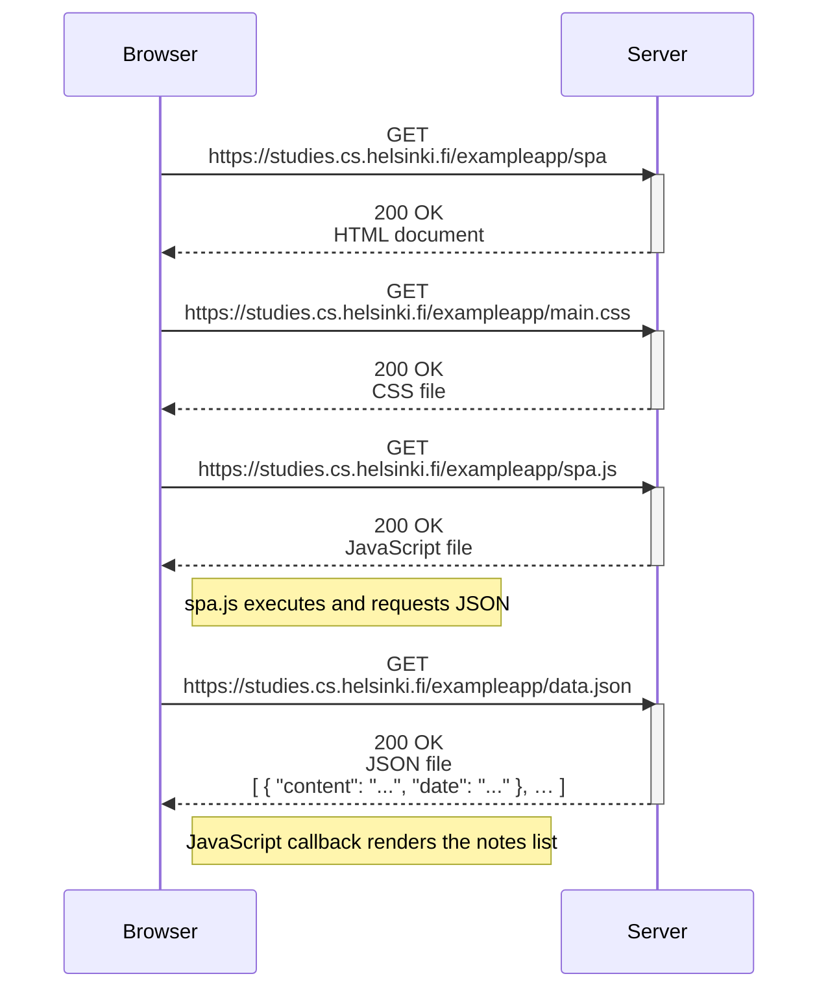

<!--
	Full stack open
	exercise 0.5: Single page app diagram
	Martin (maizena-y-javascript). 2025
-->

```mermaid

sequenceDiagram
	participant Browser
	participant Server

	Browser->>Server: GET<br>https://studies.cs.helsinki.fi/exampleapp/spa
	activate Server
	Server-->>Browser: 200 OK<br>HTML document
	deactivate Server

	Browser->>Server: GET<br>https://studies.cs.helsinki.fi/exampleapp/main.css
	activate Server
	Server-->>Browser: 200 OK<br>CSS file
	deactivate Server

	Browser->>Server: GET<br>https://studies.cs.helsinki.fi/exampleapp/spa.js
	activate Server
	Server-->>Browser: 200 OK<br>JavaScript file
	deactivate Server

	Note right of Browser: spa.js executes and requests JSON
	Browser->>Server: GET<br>https://studies.cs.helsinki.fi/exampleapp/data.json
	activate Server
	Server-->>Browser: 200 OK<br>JSON file<br>[ { "content": "...", "date": "..." }, … ]
	deactivate Server

	Note right of Browser: JavaScript callback renders the notes list

```