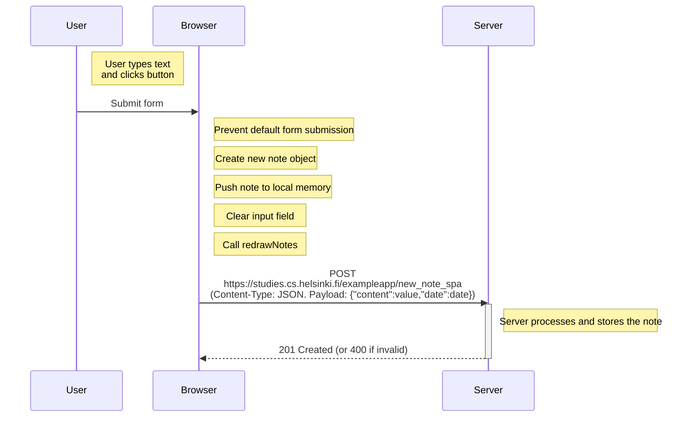

<!--
	Full stack open
	exercise 0.6: New note in Single page app diagram
	Martin (maizena-y-javascript). 2025
-->

```mermaid

sequenceDiagram
	participant User
	participant Browser
	participant Server

	Note right of User: User types text<br>and clicks button
	User->>Browser: Submit form

	Note right of Browser: Prevent default form submission
	Note right of Browser: Create new note object
	Note right of Browser: Push note to local memory
	Note right of Browser: Clear input field
	Note right of Browser: Call redrawNotes
	Browser->>Server: POST<br>https://studies.cs.helsinki.fi/exampleapp/new_note_spa<br>(Content-Type: JSON. Payload: {"content":value,"date":date})
	
	activate Server
	Note right of Server: Server processes and stores the note
	Server-->>Browser: 201 Created (or 400 if invalid)
	deactivate Server

```

